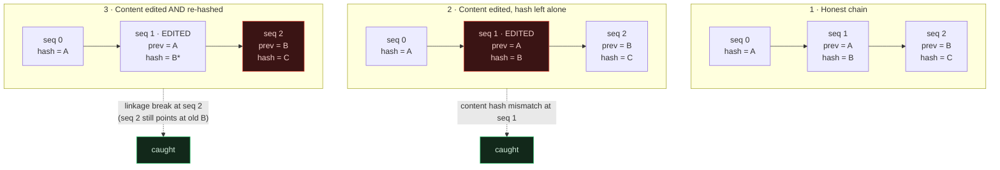
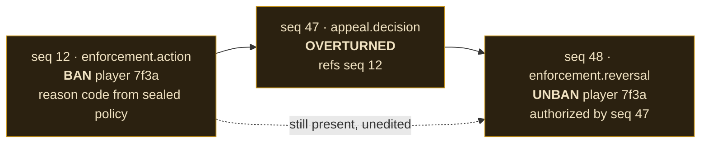
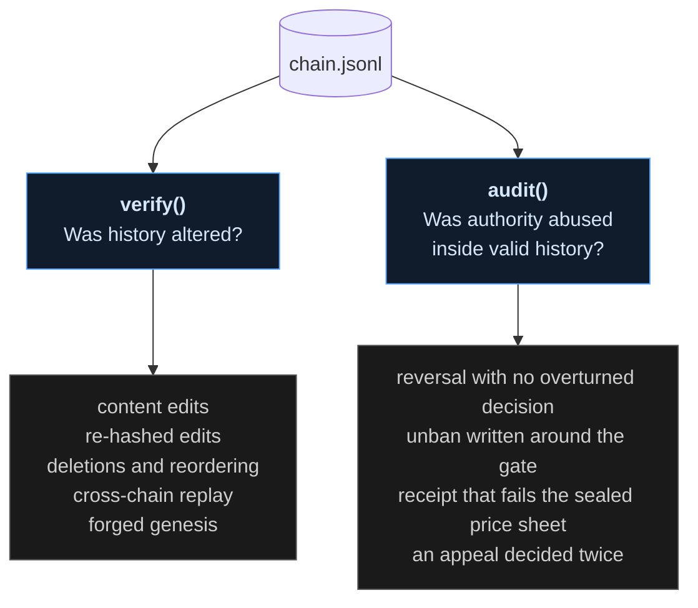
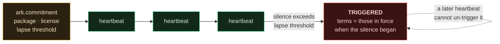

# How the charter works — four diagrams

Source for these lives here as Mermaid so they diff, version, and cannot rot
into stale screenshots. GitHub renders them inline.

---

## 1 · Tamper detection: re-hashing moves the break, it does not hide it

The counterintuitive one. Editing a link and *fixing its hash* does not repair
the chain — it relocates the failure to the **next** link, because that link
still commits to the old hash.

To hide an edit you must rewrite every link after it — which is exactly the
whole-chain regeneration that externally published tip hashes are there to
catch. See *Honest limits* in the README.

---

## 2 · Correctable, not erasable

A reversal is a **new link that references the decision it corrects**. The
original is never edited and never deleted. The full history — the ban, the
appeal, the overturn, the unban — stays readable and attributable.

An unban with no overturned decision behind it is refused at the API — and if
someone writes one straight to the chain, `audit()` names it.

---

## 3 · Two questions, two functions

Most "immutable ledger" designs answer the first and quietly imply they have
answered the second. They are different questions, and a perfectly intact
record can document an abuse of legitimate power.

---

## 4 · The Ark: lapse, and the latch

Liveness is a sealed heartbeat. If the gap between signals exceeds the lapse
threshold, the commitment triggers — and it **latches**: a silence that has
already elapsed cannot be un-elapsed by a later heartbeat, and the terms
reported are the ones in force when the silence began.

Two further rules harden this: the effective threshold is the **smallest**
lapse period ever committed (terms can only tighten), and the API refuses an
amendment that would lengthen it.

**The limit, stated plainly:** heartbeats and cessation events are both written
by the operator. It is a dead man's switch operated by the dead man. External
anchoring is what would make it adversarial rather than merely honest — and
that is not built yet.
